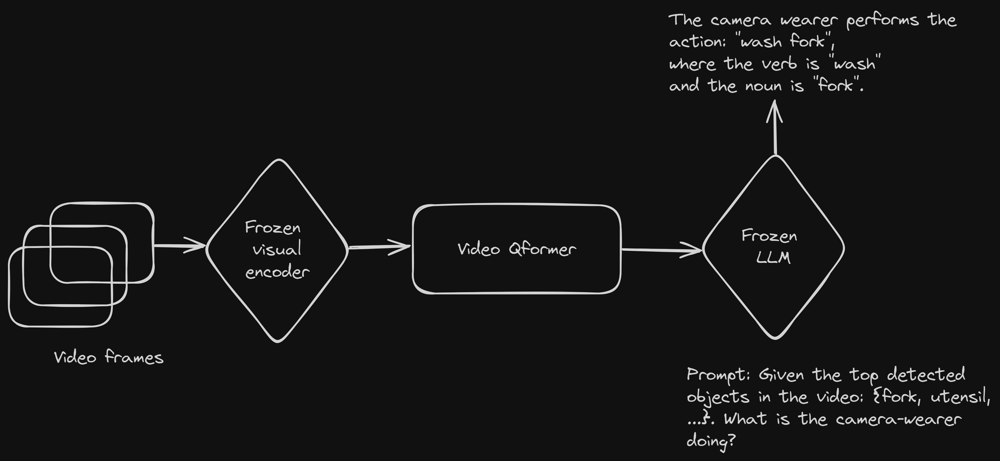

# Architecture

<figure>
  
  <figcaption>Original VideoBLIP model</figcaption>
</figure>

# Setup

1. Install the requirements for running the code

```
conda env create -f blip_ram.yml
```

2. Download the Ego4D clips and annotations following https://github.com/facebookresearch/Ego4d/blob/main/ego4d/cli/README.md:

```
python -m ego4d.cli.cli \
    --output_directory=${EGO4D_DIR} \
    --datasets annotations clips lta_models \
    --benchmarks FHO
    --version v2
```

3. Extracting the RAM_tags from [link](https://drive.google.com/file/d/1bPdlewf9ICRHOuW3qK14BdUZgPuDGWMi/view?usp=sharing)

# Training the model

Update the correct paths to the Ego4D clips, annotations and other files in the `train_qformer.sh`.
```
bash train_qformer.sh
```
